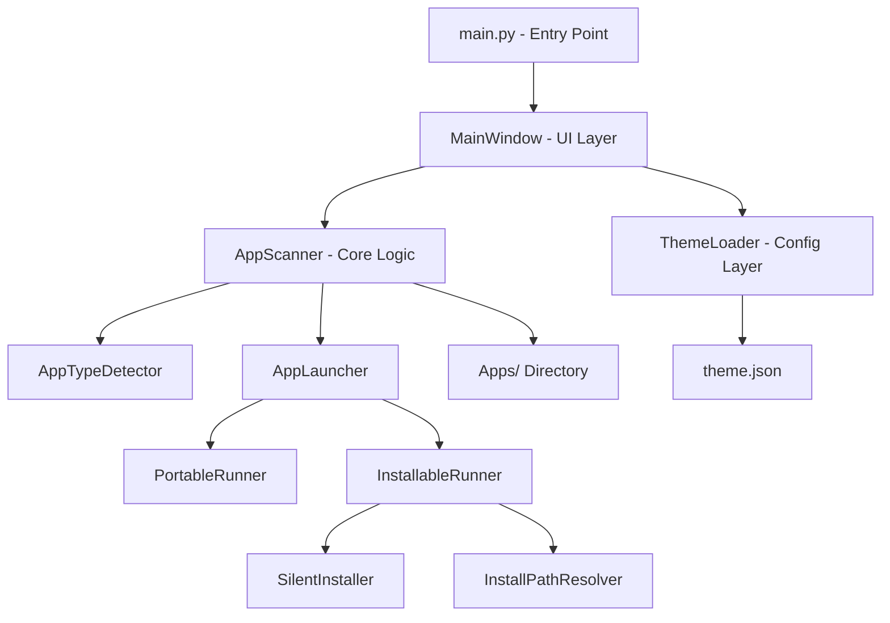

# Design Document — Dyno All In One

## Overview

Dyno All In One là một Windows desktop launcher viết bằng Python (PyQt6 hoặc tkinter), đóng gói thành file `.exe` bằng PyInstaller. Ứng dụng quét thư mục `Apps/` để tự động phát hiện các phần mềm dyno xe đua, phân loại chúng thành Portable hoặc Installable, và cung cấp giao diện dark-theme để người dùng chọn, cài đặt và khởi chạy chỉ với vài cú nhấp chuột.

Kiến trúc được chia thành ba lớp rõ ràng:
- **UI Layer**: Giao diện PyQt6 với dark theme, App_Card, Version_Card
- **Core Logic Layer**: Quét thư mục, phân loại app, xử lý cài đặt/chạy
- **Config Layer**: Đọc Theme_Config từ `theme.json`

---

## Architecture



Luồng chính:
1. Launcher khởi động → `ThemeLoader` đọc `theme.json` → `AppScanner` quét `Apps/`
2. Người dùng chọn App → hiển thị Version_Card
3. Người dùng chọn Version → `AppTypeDetector` phân loại → `AppLauncher` xử lý

---

## Components and Interfaces

### AppScanner

Quét thư mục `Apps/` và trả về danh sách app với các phiên bản.

```python
class AppScanner:
    def scan(self, apps_dir: str) -> list[AppInfo]
    # Trả về [] nếu thư mục không tồn tại hoặc rỗng

class AppInfo:
    name: str           # Tên lấy từ tên thư mục
    path: str           # Đường dẫn tuyệt đối
    versions: list[VersionInfo]

class VersionInfo:
    name: str           # Tên lấy từ tên thư mục phiên bản
    path: str           # Đường dẫn tuyệt đối
    app_type: AppType   # PORTABLE | INSTALLABLE
```

### AppTypeDetector

Phân loại phiên bản là Portable hay Installable.

```python
class AppTypeDetector:
    def detect(self, version_path: str) -> AppType
    # Tìm file .exe/.msi có "setup" trong tên (case-insensitive)
    # Nếu có → INSTALLABLE, không có → PORTABLE

class AppType(Enum):
    PORTABLE = "portable"
    INSTALLABLE = "installable"
```

### AppLauncher

Điều phối việc chạy app dựa trên loại.

```python
class AppLauncher:
    def launch(self, version: VersionInfo) -> LaunchResult
    # Gọi PortableRunner hoặc InstallableRunner tùy AppType

class LaunchResult:
    success: bool
    message: str
```

### PortableRunner

Tìm và chạy file `.exe` đầu tiên (không phải setup).

```python
class PortableRunner:
    def run(self, version_path: str) -> LaunchResult
    # Tìm .exe không có "setup" trong tên → subprocess.Popen
```

### SilentInstaller

Chạy setup file với tham số silent.

```python
class SilentInstaller:
    def install(self, setup_file: str) -> InstallResult
    # .exe → /S, .msi → /quiet /norestart
    # Trả về exit code

class InstallResult:
    success: bool       # exit_code == 0
    exit_code: int
```

### InstallPathResolver

Tìm đường dẫn cài đặt sau khi install xong.

```python
class InstallPathResolver:
    def resolve(self, app_name: str) -> str | None
    # 1. Tra registry HKLM + HKCU Uninstall keys
    # 2. Tìm trong Program Files / Program Files (x86)
    # 3. Trả về None nếu không tìm thấy
```

### ThemeLoader

Đọc `theme.json` và trả về ThemeConfig.

```python
class ThemeLoader:
    def load(self, config_path: str) -> ThemeConfig
    # Nếu file không tồn tại/lỗi → trả về ThemeConfig mặc định

class ThemeConfig:
    background_color: str   # default: "#1a1a2e"
    card_gradient_start: str  # default: "#16213e"
    card_gradient_end: str    # default: "#0f3460"
    text_color: str         # default: "#e0e0e0"
    font_family: str        # default: "Segoe UI"
    font_size: int          # default: 12
    logo_path: str          # default: "images/logo.png"
```

### UI Components

```
MainWindow
├── HeaderWidget (logo + title)
├── AppListScreen
│   └── AppCard × N (tên app, gradient background)
└── VersionListScreen
    ├── BackButton
    └── VersionCard × N (tên version, loại app)
```

---

## Data Models

### Cấu trúc thư mục Apps/

```
Apps/
├── Redleo/
│   └── Redleo_setup.msi        ← Installable
├── Apitech/
│   └── STANDALONE V9/
│       └── Apitech_setup.msi   ← Installable
├── Ate/
│   └── Ate_setup.exe           ← Installable
├── BRT/
│   └── BRT_setup.exe           ← Installable
└── Uma/
    └── Uma_setup.exe           ← Installable
```

Cấu trúc chuẩn hóa (hỗ trợ nhiều phiên bản):
```
Apps/<AppName>/<VersionName>/<files>
```

Nếu thư mục con trực tiếp chứa file (không có sub-folder phiên bản), launcher coi thư mục đó là một phiên bản duy nhất.

### theme.json

```json
{
  "background_color": "#1a1a2e",
  "card_gradient_start": "#16213e",
  "card_gradient_end": "#0f3460",
  "accent_color": "#e94560",
  "text_color": "#e0e0e0",
  "font_family": "Segoe UI",
  "font_size": 12,
  "logo_path": "images/logo.png"
}
```

### Registry lookup keys

```
HKLM\SOFTWARE\Microsoft\Windows\CurrentVersion\Uninstall\*
HKCU\SOFTWARE\Microsoft\Windows\CurrentVersion\Uninstall\*
HKLM\SOFTWARE\WOW6432Node\Microsoft\Windows\CurrentVersion\Uninstall\*
```

Các value cần đọc: `DisplayName`, `InstallLocation`, `DisplayIcon`

---

## Correctness Properties

*A property is a characteristic or behavior that should hold true across all valid executions of a system — essentially, a formal statement about what the system should do. Properties serve as the bridge between human-readable specifications and machine-verifiable correctness guarantees.*

### Property 1: App scan phản ánh đúng cấu trúc thư mục

*For any* danh sách tên thư mục hợp lệ trong `Apps/`, `AppScanner.scan()` SHALL trả về đúng số lượng `AppInfo` bằng số thư mục, và mỗi `AppInfo.name` phải trùng khớp với tên thư mục tương ứng.

**Validates: Requirements 1.1, 1.2**

### Property 2: Version scan phản ánh đúng cấu trúc thư mục phiên bản

*For any* thư mục ứng dụng chứa N thư mục phiên bản, `AppScanner.scan()` SHALL trả về đúng N `VersionInfo`, mỗi `VersionInfo.name` trùng với tên thư mục phiên bản tương ứng.

**Validates: Requirements 2.1, 2.2**

### Property 3: Phân loại Installable khi có setup file

*For any* thư mục phiên bản chứa ít nhất một file `.exe` hoặc `.msi` có chuỗi "setup" trong tên (case-insensitive, bất kể vị trí trong tên), `AppTypeDetector.detect()` SHALL trả về `INSTALLABLE`.

**Validates: Requirements 3.1, 3.2**

### Property 4: Phân loại Portable khi không có setup file

*For any* thư mục phiên bản mà không có file nào chứa chuỗi "setup" trong tên, `AppTypeDetector.detect()` SHALL trả về `PORTABLE`.

**Validates: Requirements 3.1, 3.3**

### Property 5: Silent install truyền đúng tham số theo extension

*For any* setup file có extension `.exe`, `SilentInstaller.install()` SHALL gọi subprocess với tham số `/S`; *for any* setup file có extension `.msi`, SHALL gọi với `/quiet /norestart`. `InstallResult.success` SHALL là `True` khi và chỉ khi exit code bằng 0.

**Validates: Requirements 5.2, 5.5**

### Property 6: ThemeConfig fallback khi file không hợp lệ

*For any* nội dung tùy ý (chuỗi rỗng, JSON sai cú pháp, file không tồn tại), `ThemeLoader.load()` SHALL luôn trả về một `ThemeConfig` hợp lệ với toàn bộ giá trị mặc định, không raise exception.

**Validates: Requirements 8.3**

### Property 7: ThemeConfig round-trip serialization

*For any* `ThemeConfig` hợp lệ, serialize sang JSON rồi deserialize lại qua `ThemeLoader.load()` SHALL cho ra object có tất cả các field tương đương với object ban đầu.

**Validates: Requirements 8.1, 8.2, 7.5**

---

## Error Handling

| Tình huống | Xử lý |
|---|---|
| `Apps/` không tồn tại | Hiển thị "Không tìm thấy ứng dụng nào" |
| Thư mục app không có phiên bản | Hiển thị "Không có phiên bản nào" |
| Portable: không có `.exe` | Hiển thị "Không tìm thấy file thực thi" |
| Silent install exit code ≠ 0 | Hiển thị "Cài đặt thất bại. Vui lòng thử lại." |
| Không tìm thấy app sau install | Hiển thị "Không tìm thấy ứng dụng sau cài đặt. Vui lòng khởi chạy thủ công." |
| `theme.json` không tồn tại/lỗi | Dùng ThemeConfig mặc định, tiếp tục bình thường |
| Registry lookup thất bại | Fallback sang tìm trong Program Files |

Tất cả exception từ subprocess, registry, và file I/O đều được bắt tại lớp Core Logic và trả về `LaunchResult(success=False, message=...)` thay vì crash.

---

## Testing Strategy

### Unit Tests (pytest)

Tập trung vào các hàm logic thuần:

- `AppScanner.scan()`: mock filesystem, kiểm tra số lượng và tên app trả về
- `AppTypeDetector.detect()`: mock thư mục với các file khác nhau, kiểm tra phân loại
- `SilentInstaller.install()`: mock subprocess, kiểm tra tham số được truyền đúng
- `InstallPathResolver.resolve()`: mock winreg, kiểm tra thứ tự lookup
- `ThemeLoader.load()`: kiểm tra fallback khi file lỗi, kiểm tra parse đúng

### Property-Based Tests (Hypothesis)

Sử dụng thư viện **Hypothesis** (Python), mỗi property chạy tối thiểu 100 iterations.

```python
# Tag format: Feature: dyno-all-in-one, Property N: <property_text>

# Property 1: App scan phản ánh đúng cấu trúc thư mục
@given(app_names=st.lists(st.text(min_size=1), min_size=0, max_size=20, unique=True))
def test_scan_returns_correct_count(tmp_path, app_names): ...

# Property 2 & 3: Phân loại app type
@given(filenames=st.lists(st.text(min_size=1).filter(lambda x: "setup" not in x.lower())))
def test_detect_portable_no_setup_files(tmp_path, filenames): ...

@given(setup_name=st.text(min_size=1).map(lambda x: x + "_setup.exe"))
def test_detect_installable_with_setup_file(tmp_path, setup_name): ...

# Property 5: ThemeConfig fallback
@given(bad_content=st.text())
def test_theme_loader_fallback_on_invalid(tmp_path, bad_content): ...

# Property 6: ThemeConfig round-trip
@given(config=st.builds(ThemeConfig, ...))
def test_theme_config_roundtrip(config): ...
```

### Integration Tests

- Chạy toàn bộ luồng với thư mục `Apps/` thật (dùng fixture)
- Kiểm tra UI render đúng số lượng card
- Kiểm tra silent install với mock subprocess

### Smoke Tests

- Launcher khởi động không crash
- `theme.json` mặc định được load đúng
- Icon và logo hiển thị đúng
